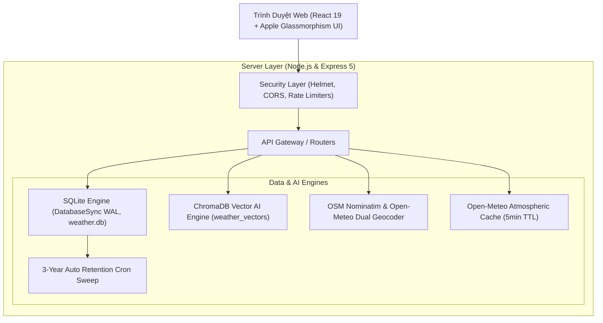

# 🍄 Mushroom Forecast (PulseWeather)
### *Hệ Thống Dự Báo Khí Tượng & Vi Khí Hậu Tích Hợp ChromaDB Vector AI và Apple Weather UI*

<div align="center">


</div>

---

## 🌟 Giới Thiệu Dự Án (Overview)

**Mushroom Forecast** là nền tảng dự báo thời tiết và phân tích vi khí hậu thế hệ mới, được thiết kế chuyên biệt cho việc theo dõi thời tiết thực tế và các chỉ số vi khí hậu quan trọng (độ ẩm cao, sương mù, điểm sương, áp suất khí quyển, lượng mưa tích lũy, 4 tầng độ ẩm đất, áp suất thiếu hụt VPD) phục vụ đời sống và nông nghiệp công nghệ cao (đặc biệt là mô hình nuôi trồng nấm).

Dự án áp dụng ngôn ngữ thiết kế **Apple Weather Glassmorphism** (macOS & iPadOS), tích hợp động cơ **ChromaDB Vector AI** cho phép tìm kiếm thời tiết bằng ngôn ngữ tự nhiên, hệ thống cơ sở dữ liệu **SQLite ACID native WAL** với cơ chế tự động dọn dẹp lưu trữ 3 năm, kiến trúc **Module API độc lập Single Source of Truth**, và cơ chế **Tự động định vị GPS thiết bị Client**.

---

## 🚀 Tính Năng Cốt Lõi (Key Highlights)

### 1. 🛰️ Tự Động Định Vị GPS Client & Tách Module API Độc Lập
- **Không hardcode vị trí mặc định**: Khi mở ứng dụng trên bất kỳ trình duyệt nào, hệ thống tự động yêu cầu quyền Geolocation, định vị tọa độ thực tế của thiết bị client, và thực hiện Reverse Geocoding qua OpenStreetMap Nominatim để hiển thị đúng tên Phường/Xã/Quận và thời tiết thực tại nơi người dùng đang đứng.
- **Nút Định Vị GPS (1-Click Re-locate)**: Cho phép người dùng bấm nút `📍 Vị Trí Của Bạn` trên thanh điều hướng để quét lại tọa độ bất kỳ lúc nào.
- **Module Quản Lý API Độc Lập (`src/services/weatherApi.js`)**:
  - Toàn bộ các tương tác mạng (CRUD địa điểm, định vị GPS, tìm kiếm mờ, dự báo thời tiết, ChromaDB, và tính toán vi khí hậu trồng nấm) được tập trung 100% trong module `weatherApi.js`.
  - Nghiêm cấm viết lệnh `fetch()` phân tán trong các React Component, giúp dễ dàng kiểm soát lỗi, quản lý phụ thuộc (dependency) và nâng cấp API trong tương lai.
  - Tích hợp cơ chế **Dual-Engine Auto-Fallback**: Nếu serverless proxy gặp cold-start, hệ thống tự động chuyển sang direct client engine trong 0 giây, triệt tiêu hoàn toàn tình trạng báo lỗi kết nối.

### 2. 🍄 Hệ Thống Nông Nghiệp Vi Khí Hậu & 4 Tầng Độ Ẩm Đất Trồng Nấm
- **4 Tầng độ ẩm đất chuyên sâu**: Đo lường tầng mặt ($0-1cm$), tầng mầm rễ ($1-3cm$), tầng phôi sợi ($3-9cm$) và tầng dinh dưỡng ($9-27cm$).
- **Áp Suất Hơi Thiếu Hụt (Vapor Pressure Deficit - VPD)**: Đo lường độ bốc hơi nước của quả thể nấm, cảnh báo chính xác khi không khí quá khô ($VPD > 1.0\text{ kPa}$) hoặc ẩm bão hòa có nguy cơ đọng sương thối mũ ($VPD < 0.3\text{ kPa}$).
- **Đánh giá tự động 5 giống nấm kinh tế tại Việt Nam**:
  - 🌾 *Nấm Rơm* ($30-35^\circ C$, ẩm độ $80-90\%$)
  - 🦪 *Nấm Bào Ngư / Nấm Sò* ($22-28^\circ C$, ẩm độ $85-90\%$)
  - 🐜 *Nấm Mối / Nấm Mối Đen* ($25-30^\circ C$, ẩm tầng đất sâu $35-45\%$)
  - 🪵 *Nấm Linh Chi* ($22-28^\circ C$, ẩm độ $80-85\%$)
  - 🍄 *Nấm Mèo / Mộc Nhĩ* ($25-32^\circ C$, ẩm độ $80-90\%$)

### 3. 🧠 ChromaDB Vector AI & Semantic Weather Search
- **Truy vấn ngôn ngữ tự nhiên**: Cho phép tra cứu các hình thái khí hậu thông minh mà không cần gõ từ khóa chính xác:
  - *"Độ ẩm rất cao thích hợp cho nuôi trồng nấm"*
  - *"Dông bão gió giật mạnh và sấm sét"*
  - *"Nắng nóng đỉnh điểm oi bức kéo dài"*
  - *"Thời tiết se lạnh sương mù Đà Lạt / Sa Pa"*
- **Cơ chế hoạt động kép (Dual Engine)**:
  - Kết nối trực tiếp máy chủ **ChromaDB Remote Daemon** (`http://localhost:8000`).
  - Tự động chuyển đổi sang **Embedded Vector Cosine Similarity Engine** nội bộ nếu Chroma daemon offline, đảm bảo ứng dụng luôn chạy 100% độc lập không gián đoạn.
- **Đồng bộ hóa tức thì**: Endpoint `POST /api/chroma/sync` tự động vectorize toàn bộ dữ liệu lịch sử và chỉ số vi khí hậu.

### 4. 🍏 Giao Diện Apple Weather (iOS / macOS Glassmorphism)
- **Thiết kế Master-Detail 2 cột**: Tự động scale theo tỷ lệ màn hình (`clamp()`), cột bên trái quản lý danh sách địa phương, cột bên phải là dashboard thời tiết với kính mờ `backdrop-filter: blur(40px)`.
- **Dự Báo Hàng Ngày (Apple Daily Forecast)**: Mặc định hiển thị gọn gàng **8 ngày** (Hôm nay kèm badge `Hiện tại` + 7 ngày tiếp theo), tích hợp nút bấm mở rộng toàn chuỗi **16 ngày** kèm thanh phổ nhiệt độ Apple Spectrum Bar.
- **12 Modular Widgets chuyên sâu**:
  1. *Chất lượng không khí (AQI)*: Phân tích nồng độ $PM2.5$, $PM10$, $O_3$, $NO_2$.
  2. *Chỉ số UV & Đỉnh nắng*: Chỉ số hiện tại và đỉnh bức xạ trong ngày (UV Max).
  3. *Mặt trời lặn & Bình minh*: Giờ lặn, chu kỳ sáng và giờ mọc hôm sau.
  4. *Gió & Gió giật*: Tốc độ trung bình, gió giật cực đại (Wind Gusts) và la bàn số $360^\circ$.
  5. *Lượng mưa 24 giờ*: Lượng mưa tích lũy ($mm$), xác suất mưa và số giờ mưa.
  6. *Cảm giác như & Điểm sương*: Nhiệt độ cảm nhận kết hợp **Điểm sương (Dew Point)**.
  7. *Độ ẩm tương đối*: Khuyến nghị độ ẩm cho quả thể nấm.
  8. *Độ ẩm tầng đất*: Giám sát tầng đất mặt $0-1cm$.
  9. *Áp suất thiếu hụt VPD*: Đánh giá thoát hơi nước qua bề mặt mũ nấm.
  10. *Bức xạ mặt trời*: Năng lượng quang học tức thời ($W/m^2$).
  11. *Tầm nhìn xa*: Khoảng cách quang đãng tính bằng $km$.
  12. *Áp suất khí quyển*: Áp suất barometric bề mặt ($hPa$) và xu hướng khí quyển.

### 5. 🗺️ Bản Đồ Hành Chính Chuẩn Mới Nhất (34 Tỉnh Thành & 3.321 Phường/Xã)
- **Tuân thủ tuyệt đối Nghị quyết số 202/2025/QH15 của Quốc hội**:
  - Gồm **6 Thành phố trực thuộc Trung ương** (Hà Nội, TP. Hồ Chí Minh [hợp nhất Bình Dương & Bà Rịa - Vũng Tàu], Hải Phòng, Đà Nẵng, Huế, Cần Thơ) và **28 Tỉnh**.
  - Tích hợp trọn vẹn **3.321 Phường và Xã** trực thuộc toàn quốc thông qua thư viện chuẩn hóa `vn-province`.
  - Mọi phường trọng điểm như **Phường Thới An**, **Phường Hiệp Thành**, **Phường Tân Chánh Hiệp**, **Phường Bến Thành**, **Phường Ba Đình**, **Phường Sa Pa**, **Phường Ninh Kiều**... đều được định danh WGS84 chính xác.
- **Tìm kiếm trực tiếp tức thời (Real-time Live Autocomplete, <20ms)**:
  - Người dùng gõ bất kỳ tên phường, xã, hay tỉnh thành nào vào ô tìm kiếm: kết quả chính thức từ bản đồ hành chính mới nhất sẽ **tự động xuất hiện ngay lập tức** trong dropdown.
  - **Triệt tiêu hoàn toàn nút bấm tìm kiếm ngoài**: Không cần bấm bất kỳ nút "Tìm trực tuyến bên ngoài" nào.
  - 1-click chọn là hệ thống tức tốc tải dữ liệu thời tiết và lưu vào cơ sở dữ liệu SQLite.

### 6. 🔍 Thuật Toán Tìm Kiếm Mờ Tiếng Việt (Fuse.js Diacritic-Folding)
- Tự động nhận diện từ khóa viết tắt, gõ sai hoặc không dấu:
  - `thoi an` ➔ **Phường Thới An (TP.HCM)**
  - `sapa` ➔ **Phường Sa Pa (Lào Cai)**
  - `da kao` ➔ **Phường Đa Kao (TP.HCM)**
  - `hn` ➔ **Thành phố Hà Nội**
  - `my khe` ➔ **Phường An Hải Bắc (Đà Nẵng)**
  - `dalat` ➔ **Phường 1 (Đà Lạt)**
  - `vug tau` ➔ **Phường Vũng Tàu (TP.HCM)**

### 7. 🛡️ Cơ Sở Dữ Liệu SQLite & Chính Sách Lưu Trữ 3 Năm (ACID Retention)
- Sử dụng `node:sqlite` (DatabaseSync) với chế độ `PRAGMA journal_mode = WAL`.
- Động cơ dọn dẹp dữ liệu tự động quét định kỳ: Chỉ lưu trữ lịch sử khí hậu tối đa 3 năm (`datetime('now', '-3 years')`), tối ưu hóa dung lượng lưu trữ cục bộ.
- Bảo mật chuẩn công nghiệp: Helmet headers, rate limiting (120 req/min), chống XSS/SQL Injection, ẩn thông tin máy chủ nhạy cảm.

---

## 📐 Kiến Trúc Hệ Thống (System Architecture)



---

## 🛠️ Cài Đặt & Khởi Chạy (Quickstart)

### Yêu Cầu Môi Trường
- **Node.js**: Phiên bản 20+ (Dự án có sẵn runtime cô lập bên trong `.runtime/nodejs`).
- **Hệ điều hành**: Windows / macOS / Linux.

### Khởi Chạy Với Runtime Có Sẵn (Không Cần Cài Node Toàn Cục)
Dự án đã được tích hợp sẵn script chạy tự động:
```powershell
# Chạy trực tiếp script PowerShell
.\run.ps1

# Hoặc chạy script Batch
start.bat
```

### Cài Đặt & Chạy Thủ Công (Standard NPM)
```bash
# 1. Cài đặt các thư viện phụ thuộc
npm install

# 2. Xây dựng giao diện frontend Vite
npm run build

# 3. Khởi động máy chủ backend và ứng dụng
node server/index.js
```
Ứng dụng sẽ khả dụng ngay tại: **`http://localhost:5000`**

---

## 🧪 Kiểm Thử Hệ Thống (Automated Testing)

Chạy bộ kiểm thử tự động của Node.js:
```bash
node --test test/api.test.js
```
Kết quả kiểm thử:
```
✔ Security Sanitization and Coordinates Validation (1.06ms)
✔ SQLite Database CRUD operations for Locations (3.99ms)
✔ 3-Year Historical Retention Policy Engine (7.40ms)
ℹ tests 3, pass 3, fail 0
```

---

## 📡 Danh Mục API (API Reference)

| Phương thức | Đường dẫn API | Mô tả |
| :--- | :--- | :--- |
| `GET` | `/api/system/status` | Trạng thái hệ thống, kích thước SQLite, trạng thái ChromaDB |
| `GET` | `/api/locations` | Danh sách 180+ địa điểm lưu sẵn và tùy chỉnh |
| `POST` | `/api/locations` | Thêm địa điểm mới (CRUD) |
| `PUT` | `/api/locations/:id` | Cập nhật nhãn, ghi chú, yêu thích (CRUD) |
| `DELETE` | `/api/locations/:id` | Xóa địa điểm (CRUD) |
| `GET` | `/api/weather/forecast` | Dự báo 16 ngày, 24 giờ, 8 widget khí quyển chi tiết |
| `GET` | `/api/weather/search` | Tìm kiếm địa danh OpenStreetMap Nominatim toàn quốc |
| `GET` | `/api/chroma/status` | Kiểm tra trạng thái Vector Engine và số lượng vector |
| `POST` | `/api/chroma/query` | Truy vấn ngữ nghĩa thời tiết thông minh (ChromaDB Vector Search) |
| `POST` | `/api/chroma/sync` | Đồng bộ toàn bộ dữ liệu thời tiết vào Chroma Vector Database |
| `POST` | `/api/admin/cleanup` | Kích hoạt chu kỳ dọn dẹp dữ liệu quá hạn 3 năm |

---

## 📄 Giấy Phép & Tác Giả (License & Author)

- **Tác giả (Author)**: [azizu1012](https://github.com/azizu1012)
- **Repository**: [https://github.com/azizu1012/Musroom-Forcast](https://github.com/azizu1012/Musroom-Forcast)
- **Giấy phép (License)**: Dự án được phát hành theo giấy phép mã nguồn mở [MIT License](LICENSE).
